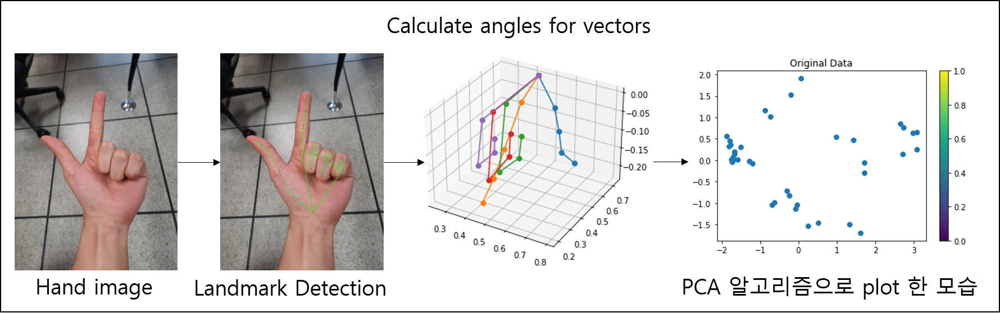
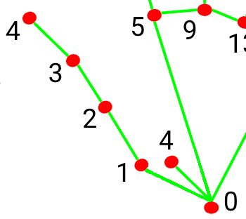
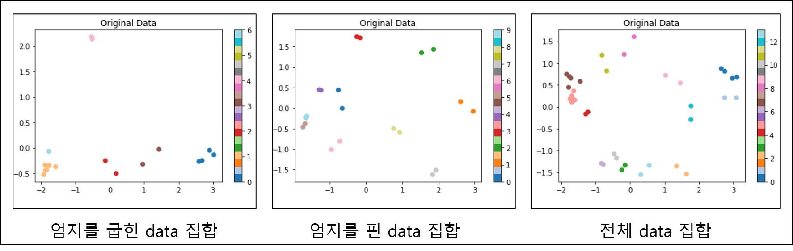
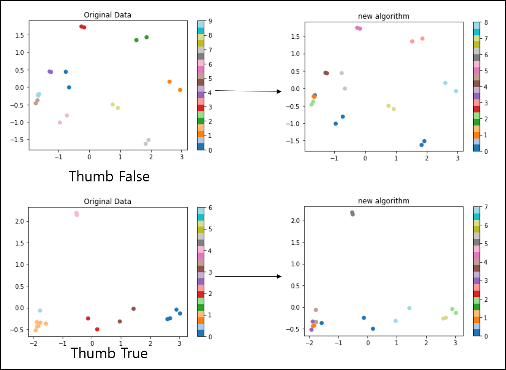

# handDetection & matching Algorithm

> 2021-10-25 한동현  


## 개요  

> 실험에 진행된 ipynb 파일은 이메일 요청 시 보내드리겠습니다. (mpolio2@kyonggi.ac.kr)  

mediapipe를 이용한 손을 인식하고, 인식한 손에 대한 landmark를 통해 매칭 해주는 알고리즘에 대해 소개한다.  
사용하는 라이브러리는 `requirements.txt`에 넣었고 *pip install -r requirements.txt* 를 통해 받아올 수 있다.  


### 구성도  

  

간단하게 정리하자면 mediapipe를 통해 손의 Landmark 좌표를 추출하고 벡터로 변환한 다음 각 Landmark의 각도를 구해서 비지도 학습으로 clustering 하는 알고리즘이다.  
(PCA 알고리즘은 보기 쉽게 하기 위해 사용했고 실제로 값을 계산할때는 사용하지 않는다.)  


## hand Detection  

먼저 mediaPipe를 사용해서 손의 landmark를 detection 하는 작업을 거친다.  
기본적인 mediaPipe의 setting은 다음과 같다.  

``` python
# mp setting
        mp_drawing = mp.solutions.drawing_utils
        mp_hands = mp.solutions.hands
        hands = mp_hands.Hands(
            static_image_mode=True,
            max_num_hands=1,
            min_detection_confidence=0.5)
```
   
이미지는 `opencv`를 통해 읽어들이고, 서버에서 base64형태의 값이 전송 될 경우 decode 한다.  
`static_image_mode`: True는 정적 이미지, False는 움직이는 손 영상에 대한 hand segmentation labeling을 제공해준다.  
`static_image_mode`: True는 정적 이미지, False는 움직이는 손 영상에 대한 `landmark` 및 annotation 을 제공해준다.
`max_num_hands`: 1 이므로 1개의 손을 인식이 가능하다.  

hands.process()에 이미지를 넣으면 그에 따른 `landmark`가 생성되게 된다.  

``` python
# result save
if result.multi_hand_landmarks is not None:
    for res in result.multi_hand_landmarks:
        joint = np.zeros((21, 3))
        for j, lm in enumerate(res.landmark):
            joint[j] = [lm.x, lm.y, lm.z]

        # Compute angles between joints
        v1 = joint[[0,1,2,3,0,5,6,7,0, 9,10,11, 0,13,14,15, 0,17,18,19],:] # Parent joint
        v2 = joint[[1,2,3,4,5,6,7,8,9,10,11,12,13,14,15,16,17,18,19,20],:] # Child joint
        v = v2 - v1 # [20,3]
```  

원래 다른 방식으로 벡터를 추출했지만 빵형의 개발도상국이라는 유튜버의 코드가 리펙토링이 잘되어 있어 참고했다.  
(https://github.com/kairess/Rock-Paper-Scissors-Machine)

위의 코드를 통해서 각 `landmark`를 추출하고 `joint`라는 list에 저장한다.  
`joint`에는 x, y, z 좌표가 기록되어있는데 구해야 할 벡터들은 parent joint에 child joint를 빼주어 생성한다.  
각 Landmark에 대한 위치는 아래의 그림에 나타내었다.  

  

v에는 손의 `landmark`에 대한 벡터 정보가 저장되어있다. (벡터는 0->1, 1->2, 2->3 ... 으로 저장되어있다.)  
우리가 구하고자 하는 각도는 0에서부터 뻗어 나가는 각 손가락 끝 점까지의 각도이므로 벡터 사이의 내적에 대한 `arccos` 값을 구해서 각도에 대한 절대 값을 구한다. 여기서 손가락은 항상 안쪽으로 구부리므로 벡터의 방향을 생각해서 절대값 그대로의 각도를 사용한다.  

``` python
# Get angle using arcos of dot product
angle = np.arccos(np.einsum('nt,nt->n',
    v[[0,5, 9,13],:], 
    v[[3,9,13,17],:]))
angle2 = np.arccos(np.einsum('nt,nt->n',
    -v[[1,2,4,5,6,8, 9,10,12,13,14,16,17,18],:], 
    v[[2,3,5,6,7,9,10,11,13,14,15,17,18,19],:]))

angle = np.concatenate((angle, angle2),axis=0)
```

`angle`과 `angle2`를 따로 구하고 concatenate를 하는 이유는 벡터의 방향이 다르기 때문에 각도를 구하는 공식을 다르게 하였다.  
여기서 중요한 점은 엄지에 대한 각도 계산이 부정확해서 clustering 알고리즘이 잘 작동되지 않았다.  
따라서 우리는 엄지를 굽혔을 때와 굽히지 않았을 때를 나눠서 계산했다.  
엄지을 굽혔을 때와 굽히지 않았을 때에 대한 `0->1` 벡터와 `3->4` 벡터 사이의 각도가 서로 다르게 나왔다. (자세한 내용은 matching algorithm에서 설명)  


## Matching Algorithm  (설계 과정)

매칭 알고리즘의 경우 위의 설명과 같이 `0->1` 벡터와 `3->4` 벡터 사이의 각도 차이를 이용해서 2개의 다른 데이터 군집을 설정했다.  
(`0->1` 벡터와 `3->4` 벡터 사이의 각도가 90도 이상인지 아닌지로 판별했다.)  
 

총 38장의 데이터에 대해서 비교해 보았을 때 결과는 다음과 같다.    

  

이 방법은 엄지를 핀 것과 굽힌 것에 대해 정확히 구분해 내었고 더 군집으로 묶기가 용이해 졌다.  
그 후 군집으로 묶을 방법을 생각해보았다.  
매우 짧은 시간마다 자주 실행하기 때문에 최대한 간단하고 정확도 높은 알고리즘을 생각해 내야 했다. 우리가 처음에 생각한 방법은 총 3가지 였다.  

    1. Kmeans
    2. DBSCAN
    3. Hierarchical clustering
    4. 손가락 벡터 기반 cos 유사도 clustering
    5. 유클리드 거리 기반 clustering Algorithm  

위의 3가지 방법들은 쉽게 구현이 가능하다는 장점이 있었으나 단점이 분명하여 제외하였다.  
- Kmeans: 군집의 수를 지정해줄 때 outlier의 처리가 애매해 질 수 있었다. (군집의 수를 정하게되면 3명이상 매칭되는 경우가 생길 수 있음.)
- DBSCAN: 하이퍼 파라미터의 값에 따라서 큰 차이를 보이기 때문에 사용하기에 어려움이 있었다. (마찬가지로 3명이상 매칭될 수 있음)
- Hierarchical clustering: 계층형 군집이 가장 잘 맞았지만, cluster의 수를 정해줘야 하기 때문에 위에서 언급한 문제들이 생겨났다.  

그래서 계층형 군집의 원리와 비슷한 알고리즘을 직접 제작해보기로 했다. 먼저 cos 유사도를 통해 군집을 모아 봤는데, 여기에는 문제가 있었다.  
- 엄지의 각도에 따라 2가지 분류로 나눠야 하는데 벡터 데이터를 사용하면 계산에 번거로움이 있음.  
- 정확도가 살짝 아쉬움.  
- 만약 가장 가까운 이미지끼리 매칭을 했을 때 마지막에 남는 이미지들은 서로 거리가 멀텐데 이것을 제한을 두는 (outlier를 판별하는) 기준점이 없음.

따라서 매칭 시스템을 위한 각도를 이용하고 거리에 제한을 두는 유클리드 기반의 알고리즘을 생각해 보았다.  
각도는 앞서 설명한 angle 코드의 17가지의 각도 데이터를 사용했다.    

### 완성된 알고리즘의 과정  
    * 각 각도를 점 좌표의 값이라고 생각했을 떄 총 17차원의 좌표계를 생각할 수 있었고 점과 점사이의 거리를 구하는 공식을 사용해 점간의 겨리를 구한다.  
    * 점과 점사이의 거리가 가까운 순으로 매칭을 잡아준다. 단 그렇게 되면 결국 매우 먼 두 점에 대해서도 매칭이 잡힐 수 있으므로 같은 손이라고 판단할수 있는 최대 거리는 1~1.5 정도라는 결론이 나게 되었다.  
    * 따라서 매칭시 1.5 이상의 거리가 나오는 점 들은 매칭 되지 않게 했고, 끝까지 매칭되지 않을 경우 outlier 처리를 했다.

이렇게 매칭된 결과를 비교해보면 다음과 같다.  

    * 굽혔을 때 않았을 때의 Accuracy: 40.00%
    * 굽히지 않았을 때의 Accracy: 94.11% 

> 38개의 data에 대한 총 Accracy: 76.31%  

생각한것보다 아쉬운 결과가 나왔고 개선 방안을 고민해보았다.  
정확도가 나오지 않은 원인은 엄지의 마디가 다른 손가락들보다 적어서 각도가 군집 알고리즘에 미치는 비율이 상대적으로 적었고,  
손가락과 손가락 사이의 각도의 차이 또한 값이 작아서 군집에 영향을 주지 못했다.  
그래서 손가락 사이의 각도와 엄지 각도에 대한 가중치를 주어 군집 알고리즘의 영향력을 키워보았다.  

이렇게 매칭된 결과를 비교해보면 다음과 같다.  

    * 굽혔을 때 않았을 때의 Accuracy: 76.47%  
    * 굽히지 않았을 때의 Accracy: 100.00%  

> 38개의 data에 대한 총 Accracy: 89.47%  

 
<엄지를 굽혔을때, 굽히지 않았을 때의 군집 알고리즘 정확도>

## 결론  

전체적으로 볼 때 90% 가량의 Accracy를 보여줬으나 다른 사진에 대해서 비슷한 성능을 낼 수 있을 것이라는 보장이 없다.  
또한 test set의 크기가 매우 적어 크기를 늘일 필요가 있다.  
개선을 위해 Kaggle의 Sign Language for Alphabets(https://www.kaggle.com/muhammadkhalid/sign-language-for-alphabets)  
데이터셋, AI허브 신체 말단 이미지 데이터셋, NVIDIA의 NVgesture 데이터셋을 요청하여 실험을 진행하려했다.  
다만 이번에는 mediapipe의 인식 성능에 문제가 있어 진행에 어려움을 격었다.  
따라서앞으로 이 애플리케이션을 상용화 하게된다면 아래 3가지를 개선하는것을 목표로 정했다.

1. mediapipe 이외의 독자적인 segmentation model 생성
2. 풍부한 데이터로 knn을 통해 먼저 군집화 한뒤, 우리가 제작한 일고리즘으로 매칭하여 정확도를 향상시키기  
3. 다양한 테스트 환경 구성

조금더 개선해보고 싶었는데, 아직 머신러닝 분야에 대한 지식도 부족하고, 시험기간과 겹쳐서 많이 아쉬웠다.  
꼭 위의 부분을 개선해보고 싶다.  